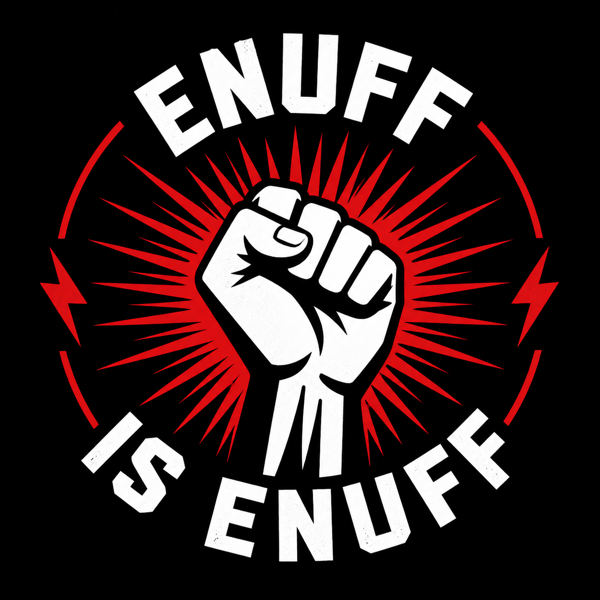

<p align="center">
  
</p>

# enuff-is-enuff-unsubscribe

## Concept

`enuff-is-enuff-unsubscribe` is a Claude plugin that helps people stop recurring email junk: newsletters, promos, abandoned SaaS drips, trial reminders, brand spam, and zombie senders that keep showing up.

It is inspired by the same product energy as `just-fucking-cancel`: a blunt, emotionally obvious consumer painkiller where Claude does annoying digital chores with user approval.

## One-line pitch

Claude scans your inbox, finds the recurring senders that will not leave you alone, and helps you unsubscribe, filter, delete, or escalate them in bulk.

## Why this should exist as a Claude plugin

Normal unsubscribe tools give users a sender list.

Claude can do something more useful:

- understand which emails are actually junk versus useful account messages
- distinguish newsletters from account/security/payment relationships
- rank the worst offenders by volume, recency, and annoyance
- explain why each sender was flagged
- find unsubscribe links and headers
- draft unsubscribe or deletion emails when links fail
- guide browser unsubscribe flows
- create Gmail filter rules when unsubscribe is not possible
- keep irreversible actions behind explicit approval

The product is not just "bulk unsubscribe." It is "make the inbox stop harassing me."

## Target user

People whose inbox is full of:

- newsletters they never read
- ecommerce promos
- abandoned SaaS onboarding drips
- creator/course launch emails
- conference/event promos
- coupon spam
- old account updates
- trial reminders
- repeated "we miss you" campaigns
- senders that make unsubscribe intentionally annoying

## Viral hook

The shareable moment:

> `enuff-is-enuff-unsubscribe` found 412 recurring senders in my inbox. I killed 137 subscriptions in one sitting.

Other hooks:

- "Claude showed me who was yelling in my inbox."
- "I stopped 60% of recurring inbox noise in 20 minutes."
- "It found old SaaS tools still emailing me from trials I forgot existed."

## Marketplace positioning

Name:

```text
enuff-is-enuff-unsubscribe
```

Display title:

```text
Enuff Is Enuff Unsubscribe
```

Short description:

> Find recurring email junk and make it stop with Claude.

Long description:

> Enuff Is Enuff Unsubscribe turns Claude into an inbox cleanup agent. It scans recent email, clusters recurring senders, ranks the worst noise, finds unsubscribe paths, drafts opt-out messages, and helps you unsubscribe, filter, or delete in bulk with approval.

## Product stance

This plugin should be local-first and privacy-forward.

Default MVP should avoid becoming a hosted SaaS with full inbox access. The safer first version should support one or both of:

- local Gmail export / `.mbox`
- user-provided email samples / exported headers

Later versions can add Gmail connector or OAuth flows if marketplace policy and user trust are clear.

## Core outputs

```text
enuff-is-enuff-report/
  report.html
  report-state.json
  sender-ranking.csv
  recommended-actions.md
  approved-actions.json
  unsubscribe-links.csv
  filter-rules.md
  draft-unsubscribe-emails/
    sender-name.md
```

## How it works (end-to-end)

The workflow is the same in plugin mode and directory mode (see *Two ways to use this* below). Only the entry points differ.

### 1. Scan

You give the path to an exported mailbox (Gmail Takeout `.mbox`, Apple Mail `.mbox` package's inner `mbox` file, Thunderbird `.mbox`, or a folder of `.eml` files).

| Plugin mode | Run the slash command: `/enuff-is-enuff-unsubscribe:scan ~/Downloads/INBOX.mbox/mbox` |
| Directory mode | Just tell Claude: *"Scan this mailbox: ~/Downloads/INBOX.mbox/mbox"* — `CLAUDE.md` tells Claude to run `node bin/enuff_scan.mjs scan …` for you |

The scanner reads only message headers (no body, no attachments) and writes:

```text
enuff-is-enuff-report/
  report-state.json        canonical scan state
  approved-actions.json    canonical approval state (all approved=false initially)
  sender-ranking.csv
  recommended-actions.md
```

`report.html` is *not* written until after review. Nothing is acted on yet.

### 2. Review (in Claude chat — the approval surface)

| Plugin mode | Run `/enuff-is-enuff-unsubscribe:review` |
| Directory mode | Just say *"walk me through the candidates"* — `CLAUDE.md` routes to the same skill |

Claude reads `report-state.json`, presents brands grouped by stream (marketing_promos, newsletter, saas_lifecycle, etc.), and **asks you which to flag** brand-by-brand. You can pick at the stream level — e.g. flag `Substack:newsletter` while keeping `Substack:marketing_promos`. Selection grammar: `Brand:stream`, `Brand:s1+s2`, `all newsletters`, `all newsletters except X`, or `none`.

Protected streams (`account_security`, `orders_receipts`, `protected_high_risk`) are locked by safety rules and never appear in the prompt.

Your selections write directly into `approved-actions.json`. Claude then renders `enuff-is-enuff-report/report.html` so you can see your approved items highlighted (green badge, green row, top summary panel listing every approval).

`report.html` is **read-only** — it is a confirmation surface, not an interactive control panel. Approval lives in the chat with Claude.

### 3. Act (one global approval, browser-driven execution)

| Plugin mode | Run `/enuff-is-enuff-unsubscribe:act` |
| Directory mode | Just say *"I'm ready to act"* — `CLAUDE.md` routes to the `safe-action` skill |

Claude first asks the global gate:

```text
Have you reviewed the report? Are you okay with everything?
```

Before processing, Claude shows you the queue (count + a one-line per-item summary) so you have a final visual pass. **One global "yes" then authorizes the entire queue** — Claude does not ask again per URL, because the per-item decisions already happened during review.

For each approved item, Claude:

1. Classifies the URL as **one-click / token** (Substack/Mailchimp/Beehiiv/etc. that unsubscribe on GET), **multi-step / account-scoped** (login or confirm required), or **mailto**.
2. Takes the action and announces the result inline as it goes:
   - **One-click / token URLs** → `fetch(url, { method: 'GET' })`, check the response for success markers, report verified completion.
   - **Multi-step URLs** → `open <url>` in your browser; noted as *needs your verification* in the final summary so the queue keeps moving.
   - **Mailto** → drafts the email and `open "mailto:…"` so it lands pre-filled in your mail client; you press send.
3. Logs the action to `enuff-is-enuff-report/action-log.md`.

When the queue is drained, Claude posts an **end-of-act summary**: counts (completed / needs-verify / mailto-pending / failed), a per-item table with ✓/⚠/✗ icons, and any items still needing your attention.

The global "yes" authorizes opening unsubscribe URLs and drafting mailto messages — nothing else. Claude never enters credentials, deletes/archives messages, creates filters, or sends mail on your behalf.

## What makes it better than a basic unsubscriber

Most unsubscribe tools optimize for speed. This plugin should optimize for judgment.

It should know:

- do not unsubscribe from banking/security alerts
- do not delete receipts blindly
- do not click suspicious unsubscribe links
- use header unsubscribe when possible
- prefer filters for senders where unsubscribe is risky
- identify account relationships worth deleting separately
- preserve evidence before bulk deletion

## First release boundary

Version 0.1 should do:

- analyze local `.mbox` or exported email metadata
- classify recurring senders
- rank worst offenders
- extract unsubscribe links when available
- generate a reviewable HTML report
- generate draft unsubscribe emails
- generate Gmail filter suggestions

Version 0.1 should not:

- directly delete email
- directly unsubscribe without approval
- ask for broad inbox credentials by default
- claim to remove all spam
- click unknown links automatically
- handle every email provider

## Two ways to use this

Pick whichever fits — both run the same workflow with the same safety rules.

### Option 1 — install as a Claude Code plugin

Plugin mode gives you slash commands that work from any directory.

**From the public repo** (recommended):

```text
/plugin marketplace add codecoincognition/enuff-is-enuff-unsubscribe
/plugin install enuff-is-enuff-unsubscribe@enuff-is-enuff-local
```

**From a local clone** (when you're modifying the plugin):

```bash
git clone https://github.com/codecoincognition/enuff-is-enuff-unsubscribe.git
# then, in Claude Code:
/plugin marketplace add ./enuff-is-enuff-unsubscribe
/plugin install enuff-is-enuff-unsubscribe@enuff-is-enuff-local
```

**Or load directly without installing** (fastest for development — no copy to cache):

```bash
claude --plugin-dir ./enuff-is-enuff-unsubscribe
```

After installation, run `/reload-plugins` whenever you edit plugin files. Then call:

```text
/enuff-is-enuff-unsubscribe:scan <path-to-mbox-or-eml-folder>
/enuff-is-enuff-unsubscribe:review
/enuff-is-enuff-unsubscribe:act
```

Plugin mode is best when you want unsubscribe workflows always available across your projects.

### Option 2 — download the repo and let Claude walk you through it

No plugin install, no git required.

1. Go to [github.com/codecoincognition/enuff-is-enuff-unsubscribe](https://github.com/codecoincognition/enuff-is-enuff-unsubscribe).
2. Click the green **Code** button → **Download ZIP**.
3. Unzip it (double-click on Mac; right-click → Extract on Windows). You'll get a folder named `enuff-is-enuff-unsubscribe-main`.
4. Move it somewhere easy to find — your Desktop works.
5. In a terminal:

```bash
cd ~/Desktop/enuff-is-enuff-unsubscribe-main
claude
```

The repo's `CLAUDE.md` auto-loads and tells Claude to walk you through the scan → review → act flow using the local `bin/enuff_scan.mjs`. Just say "I want to clean up my inbox" or paste an mbox path. No slash commands needed.

If you have git, the one-liner equivalent is:

```bash
git clone https://github.com/codecoincognition/enuff-is-enuff-unsubscribe.git && cd enuff-is-enuff-unsubscribe && claude
```

Directory mode is best for one-off use, trying it before committing to a plugin install, or running it in an environment where you don't want to install plugins (CI, ephemeral sandboxes, dev containers).

## What's in this repo

```text
.claude-plugin/plugin.json    plugin manifest (option 1)
CLAUDE.md                     directory-mode entry point (option 2)
commands/                     slash command bodies (option 1)
skills/                       canonical workflow skills (used by both options)
agents/                       agent personas (used by both options)
bin/enuff_scan.mjs            scanner / report renderer / serve (Node stdlib only)
examples/                     sample .eml files for trying it out
getting-started.html          GitHub-renderable overview page
```

Quick smoke test (works in either mode):

```bash
node bin/enuff_scan.mjs scan examples   # produces enuff-is-enuff-report/
open enuff-is-enuff-report/report.html  # macOS
# or: node bin/enuff_scan.mjs serve enuff-is-enuff-report
```

## Requirements

Only Claude Code. The scanner uses Node.js standard library only — nothing extra to install.

## Why people would install it

Because the pain is immediate:

> My inbox is full of companies that will not shut up.

The plugin promise is equally immediate:

> Claude will show you who is responsible and help make them stop.
